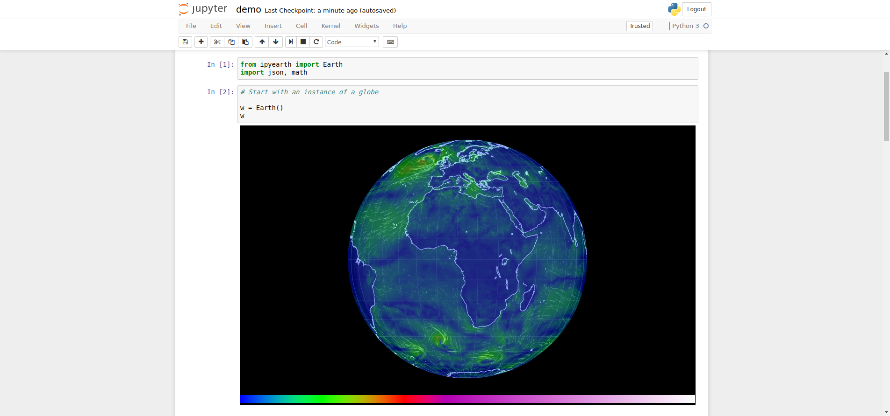

ipyearth
===============================

An IPython Widget for Earth Maps

Installation
------------

To install use pip:

    $ pip install ipyearth
    $ jupyter nbextension enable --py --sys-prefix ipyearth

For a development installation (requires npm),

    $ git clone https://github.com/davidbrochart/ipyearth.git
    $ cd ipyearth
    $ pip install -e .
    $ jupyter nbextension install --py --symlink --sys-prefix ipyearth
    $ jupyter nbextension enable --py --sys-prefix ipyearth
